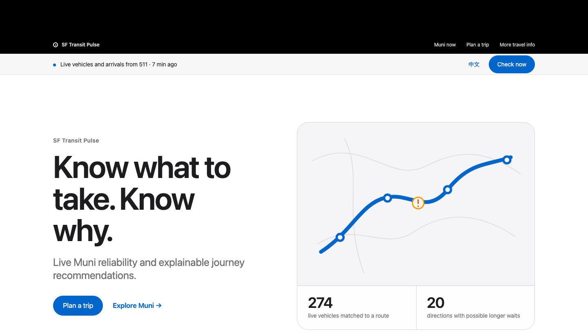

# SF Transit Pulse

<p align="right"><strong>中文</strong> · <a href="./README.md">English</a></p>

<div align="center">
  <p><strong>旧金山公交现在怎么样，我该坐哪一条，为什么？</strong></p>

  [打开中文实时网站](https://ksitcode00.github.io/sf-transit-pulse-site/?lang=zh)

  [](https://github.com/ksitcode00/sf-transit-pulse-site/actions/workflows/pages.yml)
  [](https://github.com/ksitcode00/sf-transit-pulse-site/actions/workflows/ci.yml)
  [](https://github.com/ksitcode00/sf-transit-pulse-site/actions/workflows/refresh-data.yml)
  [](https://github.com/ksitcode00/sf-transit-pulse-site/actions/workflows/refresh-watchdog.yml)
</div>



## 项目亮点

- **实时数据：** Muni 车辆位置与到站预测每三分钟更新。
- **决策引擎：** 最快到达、综合推荐和历史背景从同一组可行路线中排序。
- **解释清楚：** 推荐旁边直接显示换乘时间、运行稳定性、数据更新时间和限制。
- **生产式流程：** 511 与 DataSF → 定时采集 → 公开快照 → 浏览器 Web Worker。

SF Transit Pulse 是一个为普通乘客设计的 Muni 出行决策工具。它不仅显示预计到站时间，还会解释车辆是否挤在一起、是否可能出现长时间空档、具体换乘是否赶得上，以及不同路线为什么会被推荐。

> 当前版本是独立研究原型，不是 SFMTA 官方服务。实时预测仍会变化，请为重要行程预留时间。

## 30 秒体验

1. 打开[中文实时网站](https://ksitcode00.github.io/sf-transit-pulse-site/?lang=zh)。
2. 在“现在的 Muni”选择线路和方向，查看车辆位置、间隔和服务提示。
3. 在“规划行程”输入站点、地址或地标，例如“Ferry Building”；也可以点击“查找附近站点”，允许定位后选择 100、200、300 或 400 米范围。
4. 选择系统匹配的 Muni 站点，确认步行到站距离，再比较“最快到达”“综合推荐”和“历史背景”。

## 产品目标

大多数公交应用擅长回答“下一班车几点来”。SF Transit Pulse 继续追问：

- 同一条线路的两个方向，现在是否表现不同？
- 最快的路线是否也值得现在选择，还是另一条路线更稳？
- 推荐使用的是具体实时班次、当前运行估算，还是历史背景？
- 用户能否看懂每个结论的依据和限制？

产品原则很简单：数据能支持多少，就只说多少；限制必须放在结果旁边，而不是藏在说明书里。

## 为什么它不只是数据看板

这个项目实现了一条完整、接近生产系统的工作链路：

| 系统层 | 具体做什么 | 为什么重要 |
|---|---|---|
| 定时数据采集 | 定时获取车辆位置、班次预测、服务通知、道路事件、最新可用的停车付费活动和历史事件记录。 | 作者不需要一直开着 Notebook 或电脑，任何人都能直接使用公开网站。 |
| 缓存与新鲜度 | 按更新频率拆分不含密钥的公开文件；第二套流程独立检查公交观测是否真的够新，过期时自动恢复。 | 即使脚本成功运行，也不能用一次“成功”掩盖仍然过旧的公交数据。 |
| 线路诊断 | 按线路和方向分别计算车辆、班距、扎堆、长空档与运行状态。 | 一个方向的问题不会错误地影响另一个方向。 |
| 实时候选路线 | 保留 250 米内全部上车站点和全部空间上可行的换乘点，直到具体班次比较完成。 | 第 11 个附近站或第 9 个换乘点只要能接上更早的车，就不能被静态距离提前删除。 |
| 多目标排序 | “最快到达”“综合推荐”“历史背景”从同一组可行路线中，按公开规则分别排序。 | 用户偏好只改变排名，不会偷偷修改路线本身的预计时间。 |
| 可解释浏览器界面 | 访客设备上的 Web Worker 负责计算；实时依据、换乘余量、A/B 对比、更新时间与限制都放在推荐旁边。 | 用户不仅看到选择，也能看懂结论为什么成立、哪里仍有不确定性。 |

## 功能清单

下表按用户任务列出当前功能。每一项都说明它解决什么问题，以及乘客可以怎样使用。

| 功能 | 有什么用 | 使用示例 | 状态 |
|---|---|---|---|
| 完整 Muni 线路目录 | 不把网站限制在几条演示线路；线路菜单读取当前公开 GTFS 目录。 | 想查看 14R、38、N 或其他 Muni 线路时，直接在线路菜单中选择。 | 已上线 |
| 按线路方向查看 | 同一路线的两个方向可能表现完全不同。系统用 `route_id + direction_id` 分开车辆、班距和状态。 | 38R 西行出现长空档时，不会把东行自动标成同样不稳定。 | 已上线 |
| 实时车辆地图 | 显示车辆实际回报的位置；无法匹配到乘客线路的车辆会单独计数，不会猜测归属。 | 出门前查看下一辆 5 路车大概在走廊的哪个位置。 | 已上线 |
| 线路方向运行状态 | 把大量原始预测整理成“间隔较稳定”“部分等待可能较久”等普通人能看懂的状态。 | 14R 某个方向等待变化较大时，可以先比较 14 路或地铁。 | 已上线 |
| 车辆间隔、扎堆和长空档 | 平均到站时间可能掩盖两辆车同时到、之后很久没车的问题；本功能直接展示车辆间隔证据。 | 页面会分别显示前方车辆扎堆和后续长空档。 | 已上线 |
| 当前回报速度 | 帮助判断车辆当前移动是否明显低于同类交通方式的透明参考值；参考值不会冒充历史平均速度。 | 某段公交走廊当前中位速度明显偏低时，用户会看到减速提示。 | 有速度数据时上线；走廊历史基线安排在未来版本 |
| Muni 服务通知 | 把站点临时移动、电梯故障和服务调整放在线路旁边。 | 前往常用站点前，先看到该站临时搬到下一条街。 | 已上线 |
| 道路施工与线路背景 | 把道路事件与公交运行放在一起看，但不会把位置接近写成已经证明的延误原因。 | Market Street 附近施工且车辆变慢时，只提示“可能有关”。 | 研究功能 |
| 附近站点定位 | 用户主动允许后，在浏览器内计算当前位置与全部 Muni 站点的距离；位置不会上传或保存。 | 选择 200 米后，查看范围内所有站点、距离和可乘线路。 | 已上线，测试版 |
| 当前位置地图 | 在同一张地图中显示当前位置、选择的范围和所有匹配站点；坐标不会传到项目服务器。 | 把范围从 100 米改为 300 米，直接查看地图中新增加了哪些站点。 | 已上线，测试版 |
| 100–400 米范围选择 | 查找范围只提供 100、200、300、400 米四档。改变范围不需要再次授权定位。 | 100 米没有站点时，把范围改为 300 米重新查看。 | 已上线 |
| 附近站点设为起点或终点 | 找到站点后不必重新输入站名，减少移动端操作。 | 点击“设为起点”，再输入目的地进行路线比较。 | 已上线 |
| 站点搜索 | 输入站名即可选择起点和终点，并查看该站经过的线路；搜索在浏览器中读取公开 GTFS。 | 输入“4th St & Market”，再选择正确的站点编号。 | 已上线 |
| 地址与地标搜索 | 只搜索旧金山市内地点，把地点连接到 1,200 米内最近的 Muni 站点，并在规划前显示步行距离；不会把这段步行偷偷算进公交 ETA。 | 输入“Ferry Building”，选择地点结果，再从匹配的 Embarcadero 站点规划。 | 已上线，测试版 |
| 浏览全部站点 | 不输入任何文字也能打开按名称排序的完整 Muni 站点目录。滚动时每次加载 100 个，既能选到全部站点，也不会让页面卡住。 | 点击“浏览全部站点”，在列表中滚动，再根据站名和经过线路选择。 | 已上线 |
| 直达和一次换乘规划 | 寻找可上车与下车的站点，并排除反方向、先下后上和距离过远的假换乘。 | 从 SoMa 去 Fillmore 时，同时比较直达和一次换乘方案。 | 已上线，测试版 |
| 具体班次实时上下车时间 | 只有同一具体班次在上下车站都有有效预测，而且更新不超过 10 分钟时才标成实时；否则明确降级为估算。 | 显示预计 8:12 上车、8:27 下车和班次编号，而不是只给模糊的 15 分钟。 | 有新鲜完整预测时上线 |
| 换乘余量 | 用第一趟到达时间、换乘步行、一分钟上车余量和第二趟离开时间，计算还剩几分钟。 | 8:20 到、步行 2 分钟、8:25 开，会显示约 2 分钟余量并标成较紧。 | 实时或明确估算 |
| 实时优先选择换乘点 | 所有空间上可行的换乘点都会保留到具体班次比较阶段，不再先按步行距离只留下最近八个。 | 第九个换乘点即使稍远，只要能接上更早的车，仍然可以成为最快方案。 | 有新鲜完整预测时上线 |
| 最快到达 | 按公交行程预计时间排序。地点到站点的步行会另外显示，不计入这项 ETA。 | 快要迟到时，优先查看预计时间最短的路线。 | 已上线 |
| 综合推荐 | 同时考虑预计时间、步行、换乘、当前车辆间隔；历史报告情况只有高于全部 Muni 站点第 50 百分位的部分才会产生很小影响。 | 一条路线快 2 分钟但要多走路、换乘，或历史报告差异明显偏高时，系统可能推荐更均衡的方案。 | 已上线，默认模式 |
| 历史背景 | 把去重后的 30、90、365 天报告与全部 Muni 站点比较。直达权重为起点/上车 45%、沿途 40%、目的地 15%；换乘路线为 20%、35%、30%、15%。 | 比较路线时，让过去的区域报告产生更大影响；它不是个人安全预测。 | 研究功能 · 方法 3.0 |
| 方案 A 与方案 B 并排比较 | 任意选择两条页面中的路线，并排查看预计时间、实时依据、步行、换乘、换乘余量、稳定性、历史背景和道路背景。 | 不用反复切换卡片，就能比较“更快但换乘较紧”和“稍慢但直达”的区别。 | 已上线，测试版 |
| 目的地停车活动 | 把附近收费车位清单与最新可用的付费活动合成相对参考；最新记录超过 3 小时，或匹配到地图停车表的记录不足 70% 时，都不输出“高/低”。它不等于占用率或空位数。 | 到 Mission 接人前查看近期付费活动；DataSF 延迟时，页面会显示数据时间，不会把它叫作实时停车压力。 | 研究功能 |
| 数据新鲜度与失败状态 | 每个来源会区分“当前、保留旧副本、已过期、不可用”；只有来源可用且确实没有匹配事件时，才会显示“没有事件”。 | 道路来源失败时，页面会写“暂不可用”，不会让用户误以为道路没事。 | 已上线 |
| 稳定的自动刷新 | 路线结构使用稳定的行程 ID，当前具体班次另有班次实例 ID；新快照重新计算时不会让用户正在看的选项乱跳。 | 下一班 38R 替换上一班时，用户仍留在同一张 38R 行程卡。 | 已上线 |
| 手机端推荐栏 | 窄屏时把当前选择和 44 像素高的“查看行程”按钮保持在手边，并把比较卡片改成单栏。 | 走向车站时也能单手查看当前选择。 | 已上线，测试版 |
| 独立中英文界面 | 网址可以指定语言，按钮、状态、错误和方法说明会整体切换；选择也会保存在本机。 | `?lang=zh` 直接打开中文，`?lang=en` 直接打开英文。 | 已上线 |
| 浏览器本地计算 | 路线和附近站点计算不需要 Render 或付费服务器；后台线程避免地图卡住。地点搜索代理不使用 511 密钥，511 密钥也不会进入浏览器。 | 任何人打开 GitHub Pages 都能使用，项目作者不必开着 Notebook 或电脑。 | 已上线 |

## 和同类产品相比

这张表比较各产品官方资料明确描述的能力，不比较路线准确率。功能可能因城市、设备、系统版本和数据合作方而不同。“相关”表示竞品有接近能力，但输出或依据不同；“未见同等功能”表示所列官方资料没有描述同等能力，不代表所有地区绝对没有。

资料核对日期：2026-09-14。

| 乘客能力 | SF Transit Pulse | Google Maps | Apple Maps | Transit | Citymapper |
|---|---|---|---|---|---|
| 公交路线规划 | Muni 直达与一次换乘 | 有 | 有 | 有 | 有 |
| 实时到站信息 | 有，并区分实时与估算 | 部分站点支持 | 视地区支持 | 有 | 有 |
| 地图实时车辆 | 有，排除未归属车辆 | 相关，官方资料重点是实时出发 | 视地区支持 | 有，含乘客众包 | 有公交位置功能 |
| 当前位置附近站点与距离范围 | 有，100–400 米四档且位置留在浏览器 | 有附近交通搜索 | 有附近交通功能 | 有附近站点 | 有附近站点 |
| 地址与地标搜索 | 有，地点会匹配到最近 Muni 站点并显示步行距离 | 有 | 有 | 有 | 有 |
| 按线路方向诊断状态 | 有，两个方向分别判断 | 未见同等功能 | 未见同等功能 | 未见同等功能 | 未见同等功能 |
| 扎堆和长空档证据 | 有，显示数量与班距 | 未见同等功能 | 未见同等功能 | 相关，提供实时与乘客回报 | 相关，提供位置与交通预测 |
| 具体换乘余量 | 有，显示分钟数和计算依据 | 相关，提供连接信息 | 相关，提供连接信息 | 相关，会提示紧张换乘 | 未见同等分钟数 |
| 最快路线 | 有 | 有 | 有 | 有 | 有 |
| 时间、步行、换乘与稳定性综合排序 | 有，并说明评分组成 | 相关，支持方式与无障碍偏好 | 相关，支持交通偏好 | 相关，提示长步行与紧换乘 | 相关，支持少走路与简单路线 |
| 历史事件背景参与排序 | 有，研究功能并明确限制 | 未见同等功能 | 未见同等功能 | 未见同等功能 | 相关，可偏好主要道路，但依据不同 |
| 道路事件与公交减速交叉说明 | 有，但不声称因果关系 | 未见同等解释 | 相关，显示中断与道路事件 | 相关，显示服务提示 | 相关，处理交通与改道 |
| 目的地付费停车压力 | 有，研究功能 | 未见同等压力指标 | 未见同等压力指标 | 未见同等功能 | 未见同等功能 |
| 数据依据、更新时间和限制 | 放在结果旁边 | 相关，区分实时与时刻表 | 相关，显示实时与中断 | 相关，区分来源并加入众包 | 相关，显示实时预测与路线类型 |
| 逐步导航与到站提醒 | 尚未上线 | 有 | 有接近站点提醒 | 有导航与提醒 | 有语音和锁屏导航 |
| 未来出发或到达时间 | 尚未上线 | 有 | 有 | 有 | 有相关功能 |
| 无障碍路线 | 尚未上线，不会用普通路线冒充 | 有轮椅选项 | 所列资料未确认同等筛选 | 视城市数据支持 | 有无台阶路线 |
| 多交通方式与共享单车 | 当前只做 Muni | 有 | 有 | 有公交、单车、滑板车和网约车 | 有多交通方式组合 |

### 竞品资料

- [Google Maps：公交出发时间](https://support.google.com/maps/answer/6142130)
- [Google Maps：无障碍公交](https://support.google.com/accessibility/answer/6396990)
- [Apple Maps：公交功能](https://www.apple.com/maps/)
- [Apple 支持：公交路线](https://support.apple.com/guide/iphone/get-transit-directions-ipha44f57caa/26)
- [Transit：产品功能](https://transitapp.com/)
- [Transit：GO 导航](https://help.transitapp.com/article/549-how-to-use-go)
- [Transit：乘客众包](https://transitapp.com/en/features/go-crowdsourcing)
- [Citymapper：功能更新](https://citymapper.com/news)
- [Citymapper：无台阶路线](https://citymapper.com/news/2262/step-free-routing)
- [Citymapper：步行路线偏好](https://citymapper.com/news/2266/turn-by-turn-directions-for-walking)

## 推荐怎样计算

每次查询先生成同一组直达和一次换乘候选路线。三种模式只改变排序，不改变任何路线的实际预计时间。

| 模式 | 排序依据 | 适合什么时候 |
|---|---|---|
| 最快到达 | 公交行程预计时间；地点到站点的步行另外显示 | 只想尽快到达 |
| 综合推荐 | 预计时间 + 当前稳定性 + 步行 + 换乘 + `max(百分位 − 50, 0) × 0.03` | 希望整体更均衡，并且只让明显偏高的历史差异产生很小影响 |
| 历史背景 | 预计时间 + 当前稳定性 + 步行 + 换乘 + `max(百分位 − 50, 0) × 0.15` | 希望历史背景更明显地参与排序，并理解它不是安全预测 |

历史背景方法 3.0 在 v1 系列中固定不再漂移。百分位基准包含全部 Muni 站点，而不是只比较曾经出现事件的网格。直达路线使用“起点/上车 45%、沿途 40%、目的地 15%”；一次换乘使用“起点/上车 20%、沿途 35%、换乘 30%、目的地 15%”。缺少某部分时删除该部分并重新分配剩余权重；每部分最高按第 95 百分位计入，避免一个极端地点支配整趟路线。

v1 规划器有意限定为最多一次换乘。走廊级历史行程速度基线安排在未来版本；当前的速度提示只把最新上报的移动速度与公开的车辆类型参考值比较，不会把它写成“历史平均速度”。

## 数据真实性约定

- 只有具体班次在上下车站都有有效预测时，该段才标为实时，否则写明“估算”。
- 实时换乘需要两趟具体班次的完整预测；数据不全时退回班距估算。
- 511 刷新失败后，10 分钟内的上一份预测仍可使用，但会标成“近期缓存预测”，不会继续写成“实时预测”。
- 没有实时信息不代表线路停运。
- 道路事件来源不可用，不代表道路上没有施工或中断。
- 道路事件和减速同时出现，只能作为背景，不能证明因果关系。
- 历史事件记录不能预测犯罪、给地点贴安全标签或保证个人安全。
- 历史报告情况处于或低于全部 Muni 站点中间水平时，不增加排序成本；排序成本不会改变页面显示的预计时间。
- 停车付费记录不证明车辆仍在现场；停车压力不是占用率或空位数。
- 偏好分数只用于排序，不会显示成预计到达时间。
- 用户位置只在当前浏览器页面中计算附近站点，不上传、不保存，也不会在页面打开时自动请求。
- 地址或地标只会匹配到 1,200 米内最近的 Muni 站点；页面会显示对应站点和步行距离，而且这段步行不计入公交 ETA。

## 无服务器架构

```text
511 SF Bay + DataSF + SFMTA 公开数据
                    |
                    | 3 分钟刷新 + 独立的过期数据救援
                    | API 密钥保存在加密 Secret
                    v
          按来源拆分、不含密钥的 JSON 快照
                    |
                    | 新鲜度保护 + GitHub Pages CDN
                    v
              访客自己的浏览器
                    |
                    | Web Worker + 本地距离计算
                    v
       生成候选 -> 三种排序 -> 解释推荐理由
```

核心车辆位置与班次预测计划每 3 分钟更新；服务通知和道路背景每 15 分钟、停车每 30 分钟、安全与静态 GTFS 每天更新。正常计划在 511 官方“每个 key、滚动 3,600 秒最多 60 次”的默认限制内使用 48 次：核心数据 40 次、背景数据 8 次，保留 12 次（20%）给失败恢复、人工运行或每日静态 GTFS。若改成每 2 分钟，核心接口本身就会用满全部额度，所以本项目明确不采用这个危险频率。

Cloudflare 提供三分钟主时钟，但不直接调用 511；GitHub 官方允许的最短五分钟计划保留为备用。任何一路真正花费配额前，都会在仓库快照不足两分钟时跳过重复任务。另一个 GitHub 监控每 15 分钟检查七分钟过期条件，Cloudflare 触发前也会确认没有正在运行的更新。浏览器每 90 秒检查一次不含密钥的 Pages JSON，同样不消耗 511 配额。超过 10 分钟的预测会自动降级为估算。道路来源会同时记录原始事件数与成功解析数；响应结构异常时标记为不可用，不会冒充“0 条事件”。

同一个 Worker 还提供范围很小、只读的旧金山地点搜索代理，底层使用 Photon 和 OpenStreetMap。它只接受来自公开网站或本地开发环境的短查询，统一返回格式并缓存成功结果；它不会收到用户设备的实时位置，也不会接触 511 密钥。

官方限额依据：[511 Open Data FAQ](https://511.org/open-data/faqs) 明确写明每个 key 每 3,600 秒 60 次；[GitHub workflow 语法](https://docs.github.com/en/actions/reference/workflows-and-actions/workflow-syntax#onschedule) 写明最短间隔为五分钟，[GitHub 故障说明](https://docs.github.com/en/actions/how-tos/troubleshoot-workflows) 也说明定时任务可能延迟或丢失；[Socrata application token 文档](https://dev.socrata.com/docs/app-tokens.html) 说明已识别应用拥有独立请求池，除滥用外目前通常不会被限流；[Cloudflare Workers 限额](https://developers.cloudflare.com/workers/platform/limits/) 的免费计划每天允许 100,000 次请求，远高于本调度器每天 480 次时间戳检查。

用户查询不会调用 511，也不需要 Render。`SF_TRANSIT_511_API_KEY` 只能保存在 GitHub Actions Secret；可选的 `SF_TRANSIT_DATASF_APP_TOKEN` Secret 会让 DataSF 请求使用 Socrata 为本应用识别的独立请求池。两个值都不能写入代码、浏览器存储、Notebook 输出或公开数据文件。

## 工程成果证据

2026-09-14 核对的仓库公开快照包含 347 个车辆位置、149 个预测班次、18 条线路的 31 个线路方向记录，以及 5 条服务通知。这些数字会随当天服务和数据源变化；网页读取并显示当前数值，不会把示例数字写死。

- 经常更新的公交核心文件约 0.5 MB；道路、停车、安全和静态路网分别保存。约 2 MB 的安全背景只会在用户开始比较行程或打开背景信息区时下载，不会阻塞首次显示 Network 页面。
- `refresh-health.json` 最多保留 480 次刷新记录，约覆盖目标节奏下的一天；`source_status` 判断上游公交观测是否新鲜，`cadence_status` 单独判断自动更新是否错过 7 分钟恢复目标。
- 实时依据超过 10 分钟就失效；服务通知与道路背景为 30 分钟，停车背景为 3 小时。
- 回归测试覆盖第 11 个附近站、第 9 个换乘点、稳定行程身份、道路来源不可用，以及附加数据文件失败后的局部恢复。

## 项目结构

```text
site/
  index.html             页面结构与无障碍语义
  styles.css             响应式视觉系统
  app.js                 界面状态、地图、搜索、定位与双语文案
  nearby-stops.js        距离计算和附近站点筛选
  place-search.js        旧金山地点查询与最近站点匹配
  stop-catalog.js        站点搜索与完整目录分批加载
  planner-engine.mjs     浏览器路线引擎与排序规则
  planner-worker.js      后台计算线程
  data/                  不含 API 密钥的公开快照

scripts/
  refresh_data.py        定时收集数据并生成快照
  check_refresh_health.py 同时检查页面生成时间与公交观测时间

.github/workflows/
  refresh-data.yml       三分钟数据采集和慢速数据更新节奏
  refresh-watchdog.yml   独立检测并恢复过期快照
  ci.yml                 Python、JavaScript、流程和数据契约检查
  pages.yml              静态网站部署

backend/
  planner.py             用于一致性测试的 Python 参考实现
  main.py                旧 API 边界，实时网站不使用

data/
  static-index.json      仅供定时刷新使用、不会部署到网站的查询索引
  parking-inventory.json 仅供刷新使用、不会部署到网站的停车表位置

cloudflare/refresh-watchdog/
  worker.js              三分钟时钟、私有恢复触发与只读地点搜索
  wrangler.jsonc         免费 Cloudflare Worker 的时间表和仓库目标

tests/
  browser-planner.test.mjs  浏览器规划器功能测试
  nearby-stops.test.cjs     附近站点距离与范围测试
  place-search.test.cjs     地点查询与最近站点匹配测试
  stop-catalog.test.cjs      站点搜索与完整目录分批测试
  test_planner.py           Python 参考测试
```

### 本地预览

```bash
python3 -m http.server 8765 --directory site
```

### 浏览器规划性能基准

用仓库中的完整 Muni 路网运行固定的 100 组查询：

```bash
node scripts/benchmark_planner.mjs 100
```

输出会包含成功率、p50 / p95 / 最慢计算时间和候选数量。不同设备速度不同，因此它主要用于发现版本之间的明显性能退化，不承诺所有手机都有同一个耗时。

打开 `http://127.0.0.1:8765/?lang=zh`。不要直接双击 `index.html`，浏览器后台线程需要 HTTP 来源。

### 测试

```bash
node --test tests/browser-planner.test.mjs tests/nearby-stops.test.cjs tests/place-search.test.cjs tests/stop-catalog.test.cjs tests/refresh-watchdog.test.mjs tests/ui-evidence.test.cjs
python3 -m pytest -q tests
```

## 当前范围与下一步

| 已经可以使用 | 下一阶段 |
|---|---|
| Muni 全线路、方向和实时车辆 | 多次换乘和更完整的步行路网 |
| 地址与地标搜索，并清楚显示最近站点 | 数据完整时再开放无障碍路线 |
| 当前位置与附近 100–400 米站点地图 | 未来出发与到达时间 |
| 直达与一次换乘 | 走廊级历史速度基线 |
| 最快到达、综合推荐、历史背景 | 收藏与提醒 |
| 实时班次与换乘余量 | 逐步导航 |
| 线路、道路、历史事件和停车背景 | 扩展走廊级历史基线 |

## 数据来源

- [511 SF Bay Open Data](https://511.org/open-data/transit)：GTFS、实时车辆位置、班次更新和服务通知
- [DataSF](https://datasf.org/)：研究用途的旧金山历史事件和停车数据
- [SFMTA](https://www.sfmta.com/)：Muni 与停车项目资料
- [Caltrans QuickMap](https://quickmap.dot.ca.gov/)：公开快照可用时的道路事件背景
- [OpenStreetMap](https://www.openstreetmap.org/)：地图底图与署名
- [Photon](https://photon.komoot.io/)：基于 OpenStreetMap 的旧金山地址与地标搜索
- [W3C Geolocation](https://www.w3.org/TR/geolocation/)：浏览器定位的授权与隐私标准

## 版本

当前公开版本：`v1.5 · 出行决策测试版`

私有分析 Notebook 不在这个仓库中。仓库只包含可部署网页、无密钥数据快照、自动刷新流程、参考实现与测试。
